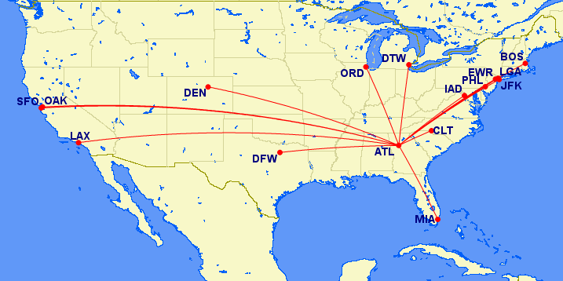
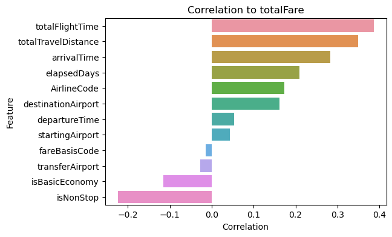

# Flight price prediction in the USA
2024 Spring, Introduction to Artificial Intelligence Final Project

## Introduction
Developing an model that can predict airline ticket prices between 16 airports in the USA.  

Using airport ATL to be an example:  

## Prerequisites
The requirements are listed in requirement.txt. 

You can set up your environment by using the command below:

    pip install -r requirements.txt

## Dataset
We use the dataset on kaggle: [Flight Prices](https://www.kaggle.com/datasets/dilwong/flightprices/data), it includes all of the flights from 2022-04-16 to 2022-10-05, from and to 16 airports in the USA. The original CSV file has nearly six million data, and 27 features. We select the flights on 2022-04-17 and keep the data of economy class only, and that will be a dataset including 7 thousands data. 

To clean and prepare the dataset for training and testing, we only keep the following 13 features, which are listed below with their correlation coefficients:

After preparing the data, we randomly separate the dataset to training data and testing data with a ratio of 8 to 2.

## Models 

hyperparameters

## Results
