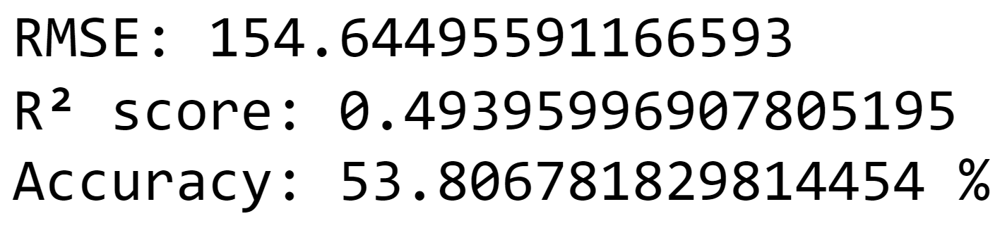
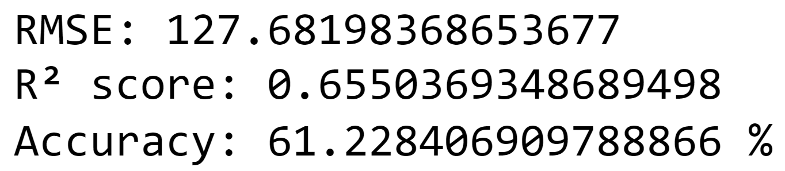
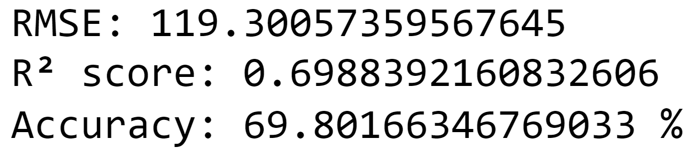
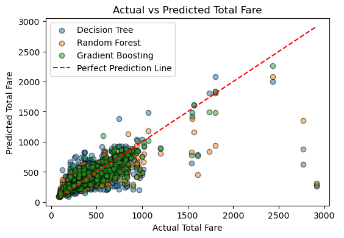
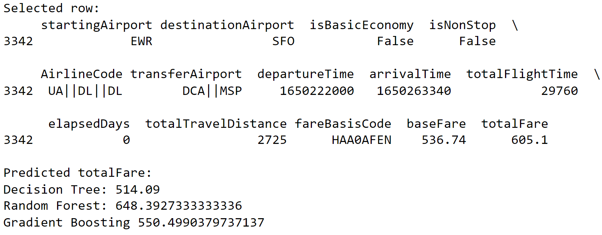

# Flight price prediction in the USA
2024 Spring, Introduction to Artificial Intelligence Final Project

## Introduction
Developing an model that can predict airline ticket prices between 16 airports in the USA.  

Using airport ATL to be an example:  

  

## Prerequisites
The requirements are listed in requirement.txt. 

You can set up your environment by using the command below:

    pip install -r requirements.txt

## Dataset
We use the dataset on kaggle: [Flight Prices](https://www.kaggle.com/datasets/dilwong/flightprices/data), it includes all of the flights from 2022-04-16 to 2022-10-05, from and to 16 airports in the USA. The original CSV file has nearly six million data, and 27 features. We select the flights on 2022-04-17 and keep the data of economy class only, and that will be a dataset including 7 thousands data. 

To clean and prepare the dataset for training and testing, we only keep the following 13 features, which are listed below with their correlation coefficients:

  

After preparing the data, we randomly separate the dataset to training data and testing data with a ratio of 8 to 2.

## Models 

hyperparameters

## Results
We are going to analyze the result from several different points of view. 

First, these are the RMSE, R2 score and accuracy result of decision tree, random forest and gradient boosting. By comparing these data, we can see that the gradient boosting algorithm performs the best among the three algorithms, the random forest comes in second, and the decision tree is the worst. This conforms to our expectation. It is worth mentioning that the gradient boosting and the random forest algorithm has a similar result in R2 score but an obvious difference in accuracy. A reasonable explanation of this phenomenon is that we only have 50 trees in both two methods, if there are more trees, the difference will be more obvious.

- Decision Tree:

  
  
- Random Forest:

  
  
- Gradient Boosting:

  
  

Second, here is a graph representing the distribution of actual and predicted total fare. We stack the graph of three results together to better observe the difference. In this graph, we can see that the distribution of the decision tree is more scattered than the other methods. The distribution of gradient boosting and random forest are slightly different, but better than the decision tree.

  

Third, let’s consider an example case and compare the prediction to the actual result. In this case, we can observe that it is unusual that the random forest performs better than gradient boosting. The possible reason is the setting of hyper parameters, learning rate and subsamples. Since we aimed to maximize the training result, some of the single cases may exist like this, which is the satisfaction of the overall performance.

&nbsp;&nbsp;&nbsp;&nbsp;&nbsp;&nbsp;&nbsp;&nbsp;
